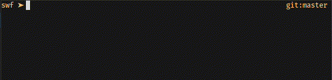
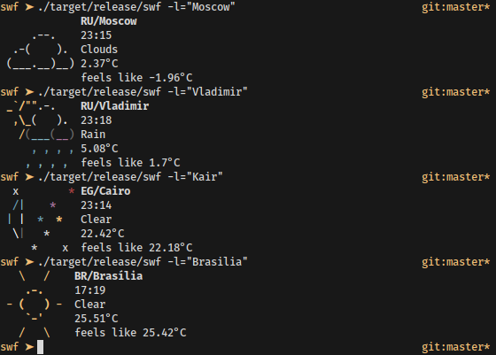

# SWF - Simple Weather Forecast



SWF - консольная программа для получения данных о погоде в заданном местоположении (локации). Использует API OpenWeatherMap. Поддерживает конфигурационные файлы с описанием основных параметров программы.

Отображает ASCII-арт текущей погоды, время в выбранном местоположении, а также температуру. В будущем будут добавляться новые функции.



## Возможности

- [X] Сведения о погоде в данный момент времени
- [ ] Сведения о погоде на несколько часов вперёд
- [ ] Красивые ASCII-арты, отображающие различные типы погоды (солнечно, облачно, пасмурно, дождь, гроза, ветрено и т.д.)
- [ ] Кеширование
- [ ] Локализация на другие языки

## Использование

- `--display=` - указывает, какие данные требуется отобразить. Допустимые значения:
  - `all` - вывести полную информацию, включая ASCII-лого, информацию о температуре, давлении и времени вызова SWF;
  - `weather-type` - краткое описание погоды (солнечно, пасмурно, дождь и т.д.);
  - `feels-like` - ощущаемая температура
  - `pressure` - давление
- `--location` - местоположение, например: `--location=Vladimir,Vladimir\ Oblast,RU`
- `--units=` - единицы измерения, в которых нужно вывести информацию. Допустимые значения:
  - `metric`;
  - `imperial`;
- `--api-key=` - ключ API OWM;
- `--config=` - путь до альтернативного конфига (по умолчанию конфиг ищется в `~/.config/swf/toml`);

Ключи, переданные программе, имеют б*о*льший приоритет, чем данные из конфига.

## Конфигурация

Конфигурация описывается в файле формата TOML. В этом файле описываются следующие параметры:

- Местоположение;
- Единицы измерения, в которых будет выведена информация;
- Ключ API;

Конфиг содержится в файле `~/.config/swf.toml`.

Каждый из параметров является *опциональным*, т.е. может отсутствовать в конфиге. Если какого-то параметра в конфиге нет, то его нужно указать, передав значение соответствующему ключу.

Пример конфига:

```toml
location = "Vladimir,RU"
units = "metric"
```

Здесь не указан параметр `api_key`, поэтому его нужно указать в ключе `--api-key=`, переданному `swf`:

```bash
swf --api-key=8sdfg6sd79f69sd87f6gsd9679
```

## Локальная сборка

### Требования

- `rustc` и `cargo` для сборки;

### Сборка

```bash
cargo build --release
cp -v ./target/release/swf ~/.local/bin
```

## Поддержка

Если вы хотите поддержать этот проект, вы можете либо принять участие в его разработке, либо отправить донат мне на карту сбербанка:

> 2202 2062 5233 5406 (Михаил Сергеевич К.)

Участие в разработке SWF или донаты покажут, что эта утилита ещё кому-то нужна, а значит будут мотивировать меня продолжать разработку и добавлять новые функции и исправлять ошибки.

## Лицензия

SWF распространяется под лицензией MIT.
